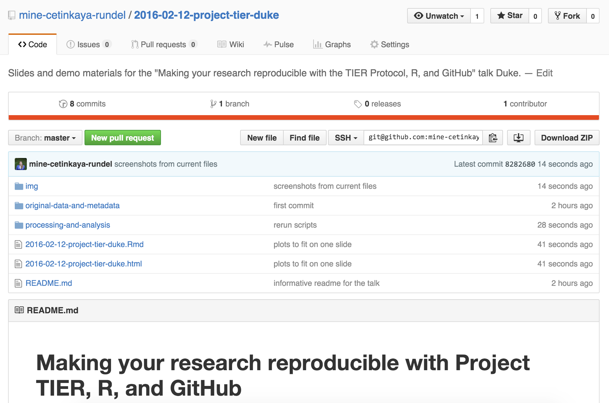
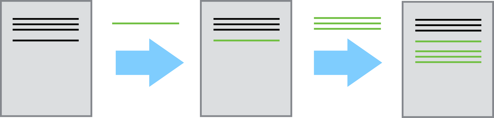
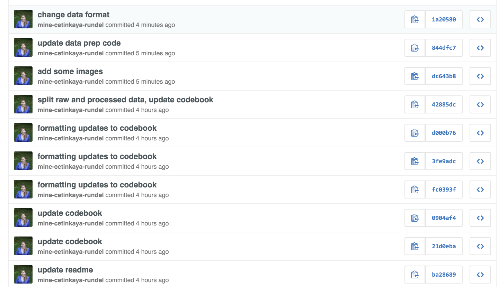
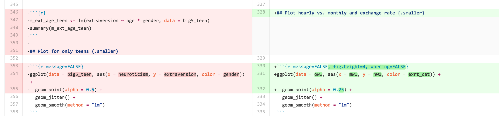
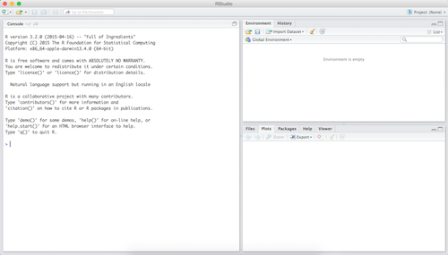
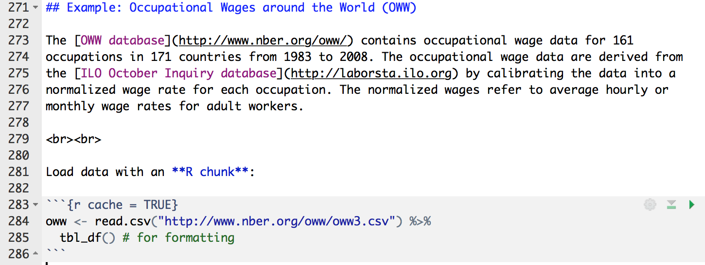
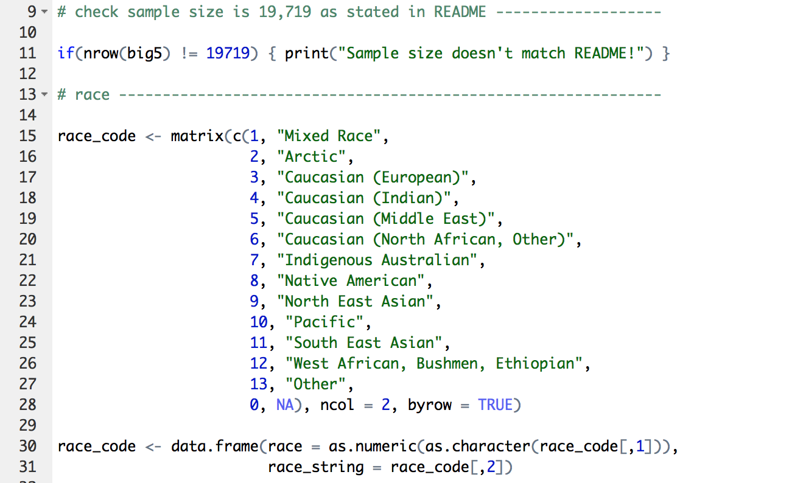

```{r echo=FALSE, message=FALSE}
library(dplyr)
library(ggplot2)
```

# Reproducibility: why should you care?

## Think back to every time...

- The results in Table 1 don't seem to correspond to those in Figure 2.
- In what order do I run these scripts?
- Where did we get this data file?
- Why did I omit those samples?
- How did I make that figure?
- "Your script is now giving an error."
- "The attached is similar to the code we used."

<br><br>

<font size="3">Source: Karl Broman</font>

## No collaborators?

<br><br><br><br>

Your closest collaborator is you six months ago, <br>
but you don’t reply to emails.
<br><br>
<font size="3">- Mark Holder</font>

<br><br><br>

# Reproducibility: how?

## Outline

<div class="columns-2">

1 Version control


<hr>

2 Literate programming


3 Scriptability


<hr>

4 All of the above


</div>

# 1. Version control

## What is version control?

- a system that records changes to files over time 
- recall specific versions later

## Bad

<center>

</center>

<font size="3">Source: Piled Higher and Deeper by Jorge Cham, http://www.phdcomics.com.</font>


## Good

~~~
    2013-10-14_manuscriptFish.doc
    2013-10-30_manuscriptFish.doc
    2013-11-05_manusctiptFish_intitialRyanEdits.doc
    2013-11-10_manuscriptFish.doc
    2013-11-11_manuscriptFish.doc
    2013-11-15_manuscriptFish.doc
    2013-11-30_manuscriptFish.doc
    2013-12-01_manuscriptFish.doc
    2013-12-02_manuscriptFish_PNASsubmitted.doc
    2014-01-03_manuscriptFish_PLOSsubmitted.doc
    2014-02-15_manuscriptFish_PLOSrevision.doc
    2014-03-14_manuscriptFish_PLOSpublished.doc
~~~


## Better - Saving everything together at once

Everytime you save:

    - zip the entire directory 
    - save it with a date


## Best - Version Control

<center>

</center>

<br>

<font size="3">Source: https://github.com/beanumber/project-tier-clark.</font>

## How does a version control system work? {.smaller}

- Start with a base version of the document, save just the changes you made at each step of the way.

- Think of it as a tape: if you rewind the tape and start at the base document, then you can play back each change and end up with your latest version.

<center>

</center>

- "Playing back" different sets of changes onto the base document and getting different versions of the document.

<center>

</center>

<font size="3">Source: [Software Carpentry](https://software-carpentry.org/).</font>

## Git/GitHub

- Easy to set up
- Integrated with [RStudio](http://www.rstudio.com)
- GitHub's strong community: your colleagues are probably already there
- Provides tools to help enhance collaboration
- A common location to share your work

> Note: GitHub repositories are **public**. 

> Can request private repositories for education or research 

## Commits

<center>

</center>

## Diff

<center>

</center>

## git/GitHub, why?

**Most powerful argument:** Automatic tracking of changes

**Other arguments:**

- No download/upload
- Ease of collaboration with ability to resolve merge conflicts
- Searchability
- [OSF integration](https://osf.io/)
- ...


# Project TIER on GitHub

## Project TIER

You can find the folder structures outlined in the TIER Protocol in the
Project TIER organization on GitHub:

https://github.com/ProjectTIER

- For R: Repository is called `ProjectTIER_R`
- For STATA: Repository **will be** called `ProjectTIER_STATA` (in progress)

## Fork

- Create a GitHub account if you don't yet have one: https://github.com/
- Form the `ProjectTIER_R` repository, which will create a copy in your account


# 2. Literate programming

## Donald Knuth "Literate Programming (1983)"

"Instead of imagining that our main task is to instruct a *computer* what 
to do, let us concentrate rather on explaining to *human beings* what we 
want a computer to do."


- These ideas have been around for years!
- and tools for putting them to practice have also been around
- but they have never been as accessible as the current tools


## What is Markdown?

- a lightweight markup language for creating documents

- Markup languages are designed to produce documents from human readable text (and annotations)

- Compare with $\LaTeX$: 
    - a (less human friendly) markup language for creating PDF documents

- Why I love Markdown:
    + Simple syntax means easy to learn and use
    + Focus on **content**, rather than **coding** and debugging 
    **errors**
    + Allows for easy web authoring
    + Once you have the basics down, you can get fancy and add HTML,
    JavaScript, and CSS

## Sample Markdown document


## What is R Markdown?

Well, it's R + Markdown:

- Ease of Markdown syntax

- Rendering of R code to produce output and plots

## Sample R Markdown document


## Another R Markdown document

<br><br><br><br>

<center>
This presentation!
</center>

<br><br><br><br>

<font size="3">Source: https://github.com/beanumber/project-tier-clark/blob/master/project-tier-clark.Rmd</font>

# 3. Scriptability

## Point-and-click vs. scripting

- Learning curve: Point-and-click apps (supposedly) have shallower learning curves than scripting languages

- Documentation: At a minimum, your code documents your analysis
    + And you can do better with comments and README files

- Automation: Need to rerun your analysis with new/updated data? Just change the input file.

- Collaboration: Sharing your analysis is as easy as sharing your scripts

## Why R?

<div class="columns-2">
- Programming language for data analysis
- Free!
- Open source
- Large user base
- Supported across disciplines
- Cross-platform: Windows, Mac OS X, or Linux
- Thousands of statistical data analysis packages


</div>


## Why not language X?

- Why not?

- R Markdown (`knitr`) supports [many rendering engines](http://yihui.name/knitr/demo/engines/):
    - Python
    - SQL
    - Stata (beta?)

## RStudio


<div class="columns-2">
- a single environment to combine your documentation and your
analysis
- Runs on top of R
- R Markdown integration
- GitHub integration
- I do pretty much everything in RStudio:
    - class notes
    - books and articles
    - websites
    - meeting agendae/minutes



</div>


## Example: Occupational Wages around the World

The [OWW database](http://www.nber.org/oww/) contains occupational wage data for 161 
occupations in 171 countries from 1983 to 2008. The occupational wage data are derived from 
the [ILO October Inquiry database](http://laborsta.ilo.org) by calibrating the data into a 
normalized wage rate for each occupation. The normalized wages refer to average hourly or 
monthly wage rates for adult workers.

<br><br>

Load data with an **R chunk**:

```{r}
load("processing-and-analysis/analysis-data/oww.RData")
```

<br><br>

<font size="3">Source: http://www.nber.org/oww/</font>

## Under the hood



## View data {.smaller}
```{r}
oww
```

## Clean data

You can include script files in your R Markdown document

```{r message=FALSE}
source("processing-and-analysis/command-files/02-data-cleanup.R")
```



## View distribution of `hw1` {.smaller}

```{r message=FALSE, fig.height=2.5}
ggplot(oww, aes(x = hw1)) +
  geom_histogram()
```

```{r}
summary(oww$hw1)
```

## Regress hourly vs. monthly and exchange rate {.smaller}

```{r message=FALSE}
m_hw1_mw1 <- lm(hw1 ~ mw1 * exrt_cat, data = oww)
summary(m_hw1_mw1)
```

## Plot hourly vs. monthly and exchange rate {.smaller}

```{r message=FALSE, fig.height=4, warning=FALSE}
ggplot(data = oww, aes(x = mw1, y = hw1, color = exrt_cat)) +
  geom_point(alpha = 0.25) +
  geom_smooth(method = "lm")
```

## Math typesetting

LaTeX:

$\hat{y} = \beta_0 + \beta_1 \times x$


## Resources

- This talk: 
    + Repo: https://github.com/beanumber/project-tier-clark
    + Slides in your browser: http://bit.ly/tier_duke

- Project TIER on GitHub: https://github.com/ProjectTIER

- Learn more:
    + R Markdown: http://rmarkdown.rstudio.com/
    + RStudio and git: https://support.rstudio.com/hc/en-us/articles/200532077-Version-Control-with-Git-and-SVN
    + Try Git: https://try.github.io
    + Reproducible Science Curriculum (2 day workshop): https://github.com/Reproducible-Science-Curriculum/